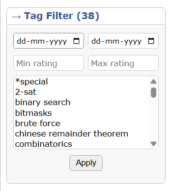
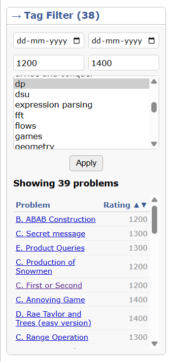

# 🚀 CF Tag Filter Extension

A Chrome extension to filter your Codeforces solved problems by **tags, date and rating range**.

---

## ✨ Features

* 🔎 Filter solved problems by tags
* 📅 Date range filtering
* 📊 Shows number of problems
* ⭐ Displays problem ratings  
* 🔽 Filter by rating range (min–max)  
* 🔽 Filter by rating range (min–max)
* 🎨 Clean UI matching Codeforces

---

## 🛠️ Tech Stack

* JavaScript
* Chrome Extensions API
* Codeforces API

---

## 📸 Screenshots




---

## 📦 Download

### 🔹 Method 1: Download Full Repository

Download the complete project as ZIP:

👉 https://github.com/adarsh7203/CF-Tag-Filter-Extension/archive/refs/heads/main.zip

---

### 🔹 Method 2: Direct Extension ZIP

Download only the ready-to-use extension:

👉 [⬇️ Download CF Tag Filter Extension](https://raw.githubusercontent.com/adarsh7203/CF-Tag-Filter-Extension/main/CF%20Tag%20Filter.zip)

---

## 🚀 How to Use (Manual Installation)

Since the extension is not yet published on the Chrome Web Store, follow these steps:

1. Download the extension (using any method above)
2. Extract the ZIP file
3. Open Chrome and go to:

   ```
   chrome://extensions/
   ```
4. Enable **Developer Mode** (top right)
5. Click **Load unpacked**
6. Select the extracted project folder

---

## ▶️ Usage

1. Go to your Codeforces submissions page
   Example:

   ```
   https://codeforces.com/submissions/your_handle
   ```
2. Select one or more tags
3. (Optional) Choose date range
4. Click **Apply**
5. View filtered problems with ratings

---

## 🔒 Privacy

This extension does not collect or store any personal data.
All data is fetched from Codeforces public API.

---

## 🚧 Future Improvements

* AND tag filtering
* Tag search
* Better analytics dashboard

---

## 👨‍💻 Author

**Adarsh Gupta**  
B.Tech CSE (AI) @ IET Lucknow

---

## ⭐ Support

If you like this project, consider giving it a star ⭐
